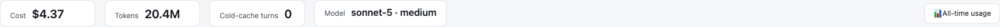
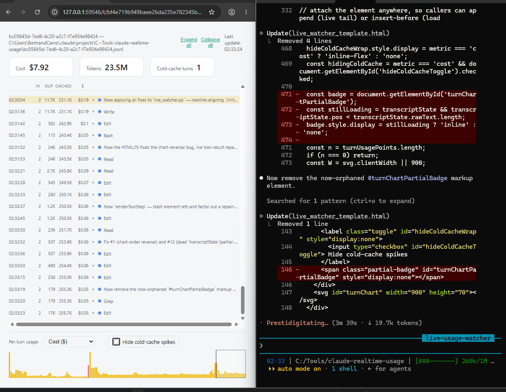

# claude-realtime-usage

*A live rerun of the conversation you're already having - subtitled in dollars and tokens.*

Tails one active Claude Code CLI session's `.jsonl` transcript and serves a live chat-transcript
view (per-turn cost/tokens, cold-cache flags, a draggable mini usage chart) in a browser tab,
updated roughly one turn behind the CLI.

Works for local session logs under `~/.claude/projects/` - the CLI, and likely the IDE extensions
(VS Code/JetBrains), since they drive the same local session format. It will **not** work for the
web app (claude.ai/code): that's cloud-hosted, with no local `.jsonl` file for this tool to tail.

Standalone, no external dependencies beyond the Python standard library. `pricing.json` holds
per-model USD/MTok rates; keep it in sync with
[Anthropic's pricing page](https://www.anthropic.com/pricing), especially around pricing changes
(e.g. the sonnet-5 intro price reverting 2026-09-01) - if a model is missing here the live view
shows a persistent "unpriced model" banner rather than a silently wrong number.

**Local only**: it reads the session's `.jsonl` file already sitting on disk - no calls to
Anthropic or anywhere else, no network access beyond serving `127.0.0.1` to your own browser. And
the watcher isn't a standalone background service you have to remember to stop: it's a child
process of the Claude Code session it's watching, so it exits automatically the moment that
session ends.

**Inherent limitation, not a bug**: a JSONL turn only exists once it's fully written, so this can
never show more than "one turn behind" the CLI.

**Subagent runs are included, with two v1 caveats**: when the CLI spawns a subagent (the
Task/Agent tool - e.g. an Explore or Plan-review agent), its transcript is written to a separate
file under `<session-id>/subagents/`, discovered by polling (not pushed via SSE, unlike the main
session), so a nested summary and the top-line totals can lag the CLI's own numbers by a few
seconds on top of the "one turn behind" caveat above. It renders nested inside the spawning
`Agent`/`Task` tool call, with a link to open that subagent's own live transcript in a new tab.
Only direct (depth-1) subagents are shown - a subagent spawning its own subagent isn't surfaced
yet. The per-turn mini chart stays main-session-only (a subagent run has no single turn position
in that timeline); its cost is folded into the tiles above the chart, not into the bars.

**"All-time usage" button**: sits at the right of the tiles row.



Bundled in `usage/` is a separate, self-contained tool
([its own README](usage/README.md)) that builds an all-sessions/all-time dashboard - distinct
from this repo's own single-live-session view. The button re-runs its two-step pipeline
(`parse.py` + `build_dashboard.py`) fresh on every click and serves the result, with a link back
to the live session. Clicking a session row there replays its full transcript inline, fetched from
this same server (a plain `fetch()`, not the `<script src>` trick that tool's own standalone
`file://` mode needs, since a real `http://` origin doesn't have that restriction) - both modes
share the one `dashboard_template.html`, branching on `location.protocol`. `usage/` can be used
standalone too (see its README) - it doesn't depend on anything else in this repo.

**Vibe-coded**: this was built almost entirely by Claude Code itself, with human review and a
couple of adversarial LLM review passes rather than exhaustive manual auditing. It's a personal
tool, not a security-hardened product - use at your own risk, and read the code before trusting
it with anything you care about.

## Getting started

```
git clone https://github.com/slyben/claude-realtime-usage.git
cd claude-realtime-usage
```

Then open a Claude Code session with this folder as the project. Skills are project-local, so
`/watch-live` is picked up automatically the next time Claude Code starts here - no separate
install step. Just say:

> Watch this session live.

(or type `/watch-live` directly) and Claude will start the server and open the transcript in a
browser tab.

For regular use, promote the skill to user scope instead of leaving it project-local: copy (or
symlink) `.claude/skills/watch-live/` to `~/.claude/skills/watch-live/`. A user-scoped skill loads
for every project's Claude Code sessions, not just when this repo happens to be the active one -
worth doing since `live_watcher.py`/`live_watcher_template.html` are resolved by the skill via
`cd`, not baked into the skill file itself, so the skill keeps working from any project once it's
promoted (as long as this repo stays checked out somewhere and the skill's `cd` step is pointed
at it).

## Demo



Recorded from an early build - the "Load full history" button in this clip reorders the
mini-chart when clicked, since fixed. Everything else shown (live tail, cost/token totals,
cold-cache flags) reflects current behavior.

## Usage

The intended way to use this is the `/watch-live` skill (`.claude/skills/watch-live/`), which
starts the server as a background process for *this exact session* and prints the URL - open it
in whatever browser you normally use. `/watch-live auto` additionally opens it for you in a
Playwright-controlled tab, if the Playwright MCP plugin is connected. See that skill for the
concrete steps.

To run it manually instead:

```
python live_watcher.py --session <session-uuid>
```

`--session` is required (a bare run without it lists available sessions and exits) - this tool
never guesses which session to watch, so it's safe to run several instances in parallel across
different Claude Code sessions in the same project without ever mixing up which transcript is
shown. It prints the local URL to open (`http://127.0.0.1:<port>/t/<token>/`); the port is
OS-assigned by default (`--port 0`) to avoid clashes between concurrently-watched sessions, and
the URL includes a random token since the server has no other auth.

The watcher is a plain foreground process when run manually - `Ctrl+C` to stop it. When launched
via the skill's `run_in_background`, it's a child of that session's shell and exits automatically
when the Claude Code session does.

### `/clear` orphans the watcher

`/clear` doesn't end the CLI session or kill its background shell - it rotates the session onto a
brand-new `.jsonl` transcript file, same session process, same background watcher. The watcher's
`--session` is fixed at startup, so it keeps tailing the old, now-dead file and the browser tab
just goes quiet. Simplest fix: re-run `/watch-live` after a `/clear` - it targets *this* session's
current UUID and starts a fresh watcher.

To also reap the orphaned process automatically instead of leaving it running until the session
ends, add a `SessionStart` hook with `matcher: "clear"` to your **user** `~/.claude/settings.json`
(not this repo's project settings - it needs to fire for any project you run `/watch-live` in). It
scans `live_watcher.py`'s own lockfile directory for any lockfile pointing at a `.jsonl` in the
same project that isn't this new session's transcript, and kills its recorded PID.

**macOS/Linux only** - the command is bash (`dirname`, `read -r`, `${f%.json}`, `python3`), and
Claude Code hooks default to PowerShell on native Windows unless Git Bash is detected and
`"shell": "bash"` is set explicitly; even then, Windows Python installs typically expose `python`,
not `python3` (see the `/watch-live` skill's own platform note). No PowerShell equivalent is
provided here - untested and not worth shipping unverified.

```json
{
  "hooks": {
    "SessionStart": [
      {
        "matcher": "clear",
        "hooks": [
          {
            "type": "command",
            "command": "jq -r '.transcript_path // empty' | { read -r NEWPATH; if [ -z \"$NEWPATH\" ]; then exit 0; fi; DIR=$(dirname \"$NEWPATH\"); LOCKDIR=$(python3 -c \"import tempfile,os;print(os.path.join(tempfile.gettempdir(),'live_watcher'))\"); for f in \"$LOCKDIR\"/*.json; do [ -f \"$f\" ] || continue; OLDPATH=$(jq -r '.jsonl_path // empty' \"$f\" 2>/dev/null); [ -z \"$OLDPATH\" ] && continue; [ \"$OLDPATH\" = \"$NEWPATH\" ] && continue; [ \"$(dirname \"$OLDPATH\")\" = \"$DIR\" ] || continue; PID=$(jq -r '.pid // empty' \"$f\" 2>/dev/null); [ -n \"$PID\" ] && kill \"$PID\" 2>/dev/null; rm -f \"$f\" \"${f%.json}.lock\"; done; exit 0; } 2>/dev/null || true"
          }
        ]
      }
    ]
  }
}
```

Not bundled or auto-installed by this repo - it's a personal convenience, opt in by hand. Merge it
into your existing `hooks.SessionStart` array rather than replacing it.

## Files

- `live_watcher.py` - stdlib-only Python server (no dependencies to install).
- `live_watcher_template.html` - the browser-side transcript/chart renderer.
- `pricing.json` - per-model USD/MTok rates, own copy (see note above).
- `.claude/skills/watch-live/` - the `/watch-live` skill.
- `usage/` - the bundled all-sessions/all-time dashboard tool behind the "All-time usage" button
  (own README, own `pricing.json`, own `/claude-usage` skill - see [usage/README.md](usage/README.md)).

Both the server and the `/watch-live` skill are cross-platform (macOS/Linux/Windows) - the skill
branches its Python invocation (`python3` vs `python`) and stop fallback (`kill` vs `taskkill`) by
detected OS.

## License

MIT - see [LICENSE](LICENSE).
